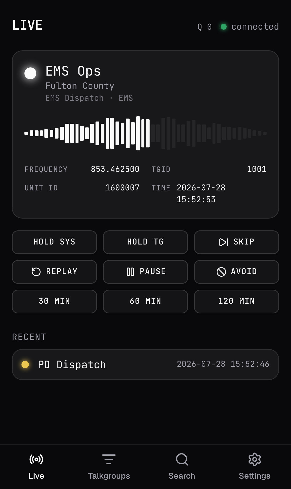
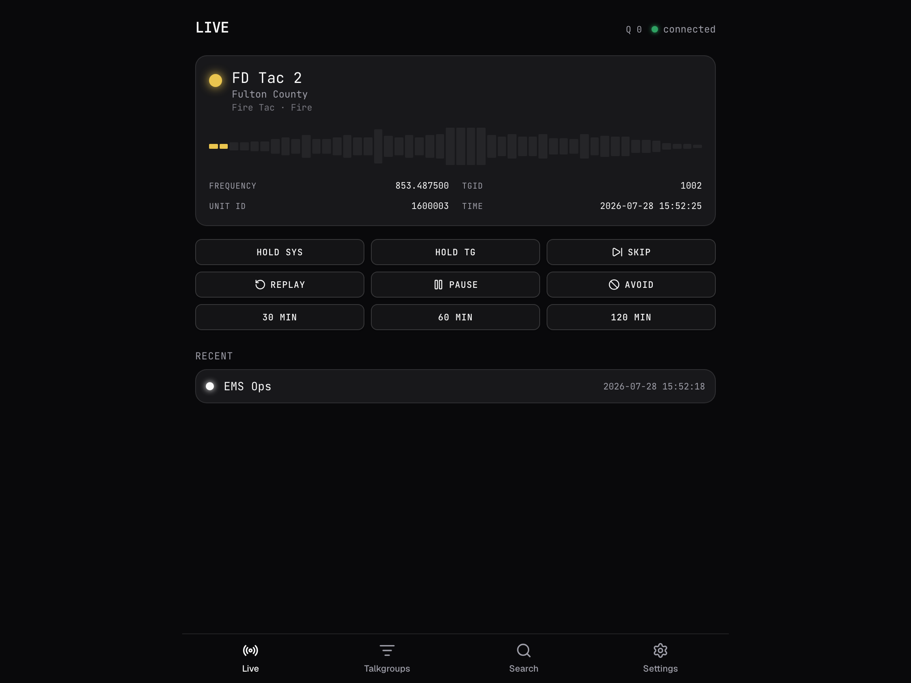
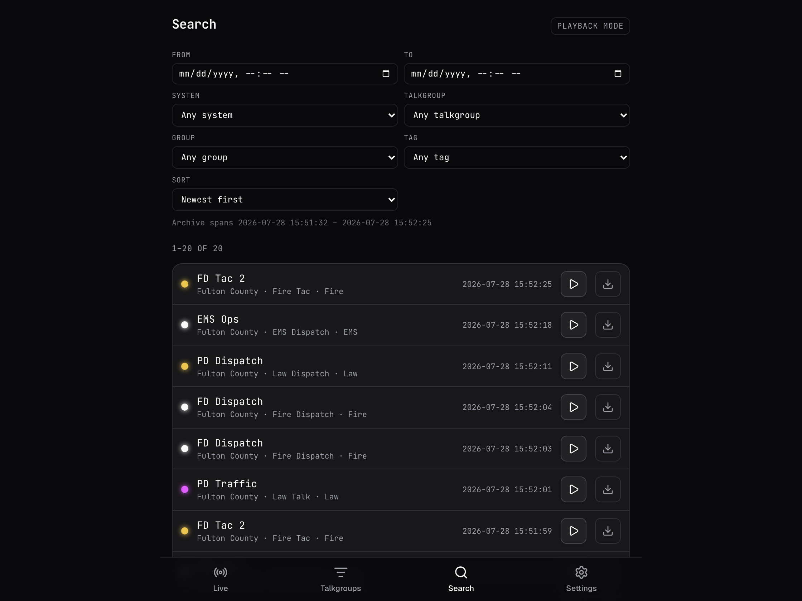
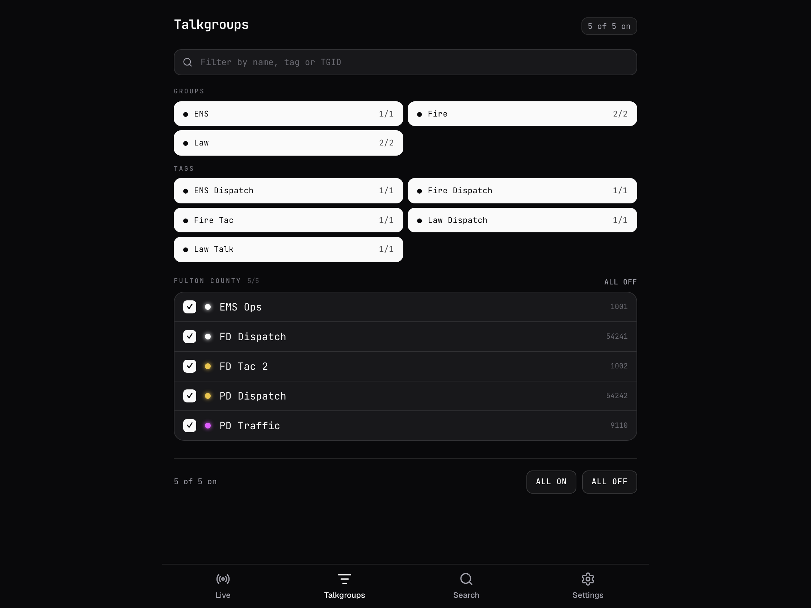

<div align="center">

# Radio-Scout

**A replacement for [rdio-scanner](https://github.com/chuot/rdio-scanner).**
Scanner audio from Trunk Recorder and SDRTrunk — one static binary, and a phone app that actually works.

[](https://github.com/FxllenCode/radio-scout/actions/workflows/ci.yml)
[](LICENSE)



</div>

---

Point your recorder at it and calls start arriving. Radio-Scout speaks rdio-scanner's upload
API exactly — same endpoint, same fields, same response strings — so **Trunk Recorder and
SDRTrunk need no plugin and no patch**, just a different URL. Everything downstream of that
upload is rebuilt.

It is one file. The web app is compiled into the binary, the first run creates its own
database and audio store, and there is nothing else to install — no runtime, no ffmpeg, no
package manager. It is built to run on a Raspberry Pi that is already busy running the
recorder.

## Why replace rdio-scanner?

rdio-scanner works, and it has been the default for years. These are the things it does that
Radio-Scout deliberately does differently.

**Audio that survives your phone locking.** rdio-scanner ships call audio as a JSON array of
integers over its WebSocket and plays it through the WebAudio `AudioContext`. iOS suspends
that context in the background and will not attach lock-screen controls to it, so the audio
stops when you put the phone away. Radio-Scout serves real URLs to a real `<audio>` element
and drives the Media Session API, which is the arrangement iOS actually honours — so
play/pause/next work from the lock screen and Control Centre, and playback keeps going while
the screen is off.

**Audio out of the database.** rdio-scanner stores call audio as BLOBs in its database, and
audio is ~99% of the data volume. Radio-Scout keeps only metadata in the database and puts
audio in an object store — a plain directory by default, or S3/Garage/MinIO when you'd rather
it lived on a NAS. The database stays small enough that SQLite is genuinely the right default,
and backing the whole thing up stays "copy one folder".

**A connection that notices when it dies.** Its own live-feed protocol with a heartbeat, so a
half-open connection is detected and reconnected rather than silently delivering nothing.

**Notifications that don't storm you.** Web Push to an installed phone app, coalesced to at
most one notification per Talkgroup per device per window — each carrying a count of the calls
it stands for, so a busy system never turns into 200 buzzes and nothing is silently dropped.

**Talkgroup import that doesn't corrupt your data.** Same RadioReference CSV, parsed properly:
a quoted `"Fire, EMS"` stays one field, re-importing updates rather than duplicating, a blank
cell means "leave alone" rather than "erase", and every rejected row is reported with its line
number and a reason.

## Screenshots

<table>
<tr>
<td width="33%"><br><em><strong>Live</strong> — the current Call, hold, avoid, and what just played</em></td>
<td width="33%"><br><em><strong>Search</strong> — the Archive, filtered by system, talkgroup, group, tag and time</em></td>
<td width="33%"><br><em><strong>Talkgroups</strong> — pick what you hear, by group, by tag, or one at a time</em></td>
</tr>
</table>

## Install

```sh
curl -fsSL https://raw.githubusercontent.com/FxllenCode/radio-scout/master/install.sh | sh
```

> **While 0.1.0 is a release candidate, pin it** — the installer resolves the *latest* release
> and pre-releases are deliberately excluded from that:
> ```sh
> curl -fsSL https://raw.githubusercontent.com/FxllenCode/radio-scout/master/install.sh | sh -s -- --version v0.1.0-rc.2
> ```

It works out which binary your machine wants, verifies it against the release's published
SHA-256, and installs to `/usr/local/bin` — or `~/.local/bin` when that isn't writable, so it
needs no root. Piping a script into your shell should make you uncomfortable; read it first,
and `--dry-run` tells you exactly what it would fetch and where it would put it.

Prebuilt binaries cover the Raspberry Pi and everything else:

| Platform | Target |
| --- | --- |
| Raspberry Pi / 64-bit ARM Linux | `aarch64-unknown-linux-musl` |
| 64-bit x86 Linux | `x86_64-unknown-linux-musl` |
| Apple Silicon Mac | `aarch64-apple-darwin` |
| Intel Mac | `x86_64-apple-darwin` |
| Windows | `x86_64-pc-windows-msvc` |

The Linux builds are **statically linked against musl**, so the same file runs on Raspberry Pi
OS, Debian, Ubuntu, Alpine and a container built `FROM scratch`. No `GLIBC_2.38 not found`.

Docker, running it at boot as a service, and building from source are all in
**[docs/deploy.md](docs/deploy.md)**.

## Run it

```sh
radio-scout
```

That's the whole thing. It creates `./radio-scout-data`, generates an ingest key and an admin
password into `.env`, and serves on <http://localhost:3000>. Secrets are written to that file
and never to the log, so `cat .env` is how you read them back after the scrollback is gone.

Then point a recorder at it. For Trunk Recorder, add an entry to `plugins` in `config.json` —
alongside any existing rdio-scanner entry, which keeps working untouched:

```jsonc
{
  "name": "radio-scout",
  "library": "librdioscanner_uploader.so",
  "server": "http://<your-scanner-host>:3000",
  "systems": [
    { "shortName": "<from your systems config>", "apiKey": "<RADIO_SCOUT_API_KEY from .env>", "systemId": 411 }
  ]
}
```

`server` is a **bare base URL** — the plugin appends the path itself. Unknown Systems,
Talkgroups and Units are created the first time they're heard, so there is nothing to
configure before calls start landing.

SDRTrunk, `talkgroupAllow` globs, and how to read upload failures are in
**[docs/recorders.md](docs/recorders.md)**.

## What you get

**Listening.** A live feed that plays Calls as they arrive, filtered to the Talkgroups you
selected. **Hold** narrows to the current System or Talkgroup and restores what you had when
you let go. **Avoid** mutes a Talkgroup, optionally for 30/60/120 minutes after which it comes
back on its own. A listening queue shows how far behind you are. **Profiles** let one browser
run two independent setups — a "truck" and a "desk" that share nothing.

**The Archive.** Every Call kept, searchable by system, talkgroup, group, tag and time range,
playable in place or downloadable. Range requests are served properly, which is what lets iOS
seek without re-downloading.

**On your phone.** Installable to the home screen, works offline for the app shell, and Web
Push notifies you about Talkgroups you care about when you're *not* already listening.

**Audio enhancement** *(off by default)*. Reprocesses stored audio so Talkgroups sit at a
consistent loudness instead of swinging between painful and inaudible — voice band-pass plus
EBU R128 normalization, with optional RNNoise suppression. It never runs on the ingest path:
a recorder's upload is answered before any of it starts.

**Retention.** Prune by age, by total size, or both. A sweeper ages Calls out, enforces the
cap, and reclaims audio no Call points at.

Full detail: **[docs/using.md](docs/using.md)** for listening, **[docs/operating.md](docs/operating.md)**
for running it.

## Coming from rdio-scanner

**What is identical.** Your recorders. The upload endpoint, its field names, its aliases and
its exact response strings are a wire contract here, pinned by a test suite that replays
captured recorder payloads byte for byte. Your RadioReference talkgroup CSV imports unchanged.

**What is better.** Everything in [Why replace rdio-scanner?](#why-replace-rdio-scanner) above.

**What is missing.** Being straight with you, because these are the things you'd find out
after switching:

- **Your existing archive does not come across.** rdio-scanner keeps audio as BLOBs in its
  database; Radio-Scout keeps objects and metadata. There is no importer, so you start the
  Archive from empty. Run both side by side during cutover — recorders happily upload to two
  servers at once.
- **No access codes yet.** Listening is open to anyone who can reach the instance; scoped,
  per-listener PINs are not built. Put it behind a VPN or a reverse proxy with auth if that
  matters.
- **No admin web UI.** Configuration is a TOML file, environment variables and flags. The
  admin surface currently covers login and talkgroup CSV import.
- **`/rdio-scanner` is not served.** Radio-Scout does not host the legacy app.
- **A different UI.** It is a replacement, not a reskin — the screens are not where rdio put
  them.

Cutover procedure: **[docs/migrating-from-rdio-scanner.md](docs/migrating-from-rdio-scanner.md)**.

## Configuration

Four layers, loudest first: **command-line flag → environment variable → `radio-scout.toml` →
default**. No config file is not an error — that's the zero-config first run.

```sh
radio-scout --write-config          # a commented file with every setting at its default
radio-scout --help                  # every flag
```

`--write-config` is the reference: every setting, its default, and a note on when you'd want
to change it. Two tests hold it to being complete, so a setting cannot be added without
appearing there. An unknown key or an unparseable value **refuses to boot** and says which
layer it came from, rather than being silently ignored.

Three credentials never live in the TOML, because first run *writes* them: the ingest API key,
the admin password, and the Web Push identity. They go to `.env`, created `0600`, with only
the path logged.

## Documentation

| Document | For |
| --- | --- |
| [docs/deploy.md](docs/deploy.md) | Installing: the installer, prebuilt binaries, running at boot, Docker, building from source |
| [docs/recorders.md](docs/recorders.md) | Pointing Trunk Recorder and SDRTrunk at it |
| [docs/operating.md](docs/operating.md) | Running it: storage, database, retention, enhancement, admin, logging, reverse proxies |
| [docs/using.md](docs/using.md) | Using the app: selection, hold, avoid, search, notifications, installing on a phone |
| [docs/migrating-from-rdio-scanner.md](docs/migrating-from-rdio-scanner.md) | Switching over |
| [CONTEXT.md](CONTEXT.md) | The project's vocabulary — Call, Talkgroup, Selection, Instance |
| [docs/adr/](docs/adr/) | Why it is built the way it is |
| [CLAUDE.md](CLAUDE.md) | Contributing: the constraints, the test policy, the workflow |

## Building from source

Needs Rust and Node. The web app has to be built first, because it is compiled into the
binary:

```sh
cd client && npm ci && npm run build && cd ..
cargo build --release
```

Development is test-first under a coverage policy that gates every pull request — 100% patch
coverage over a ratcheting floor, with mutation testing to prove the assertions actually catch
regressions. The suite runs on both SQLite and Postgres, against real S3, and natively on
arm64. See [CLAUDE.md](CLAUDE.md).

## Licence

[GPL-3.0](LICENSE). Radio-Scout is an independent implementation; rdio-scanner is a separate
project, also GPL-3.0, and is neither included nor derived from here beyond the upload API it
defined.
