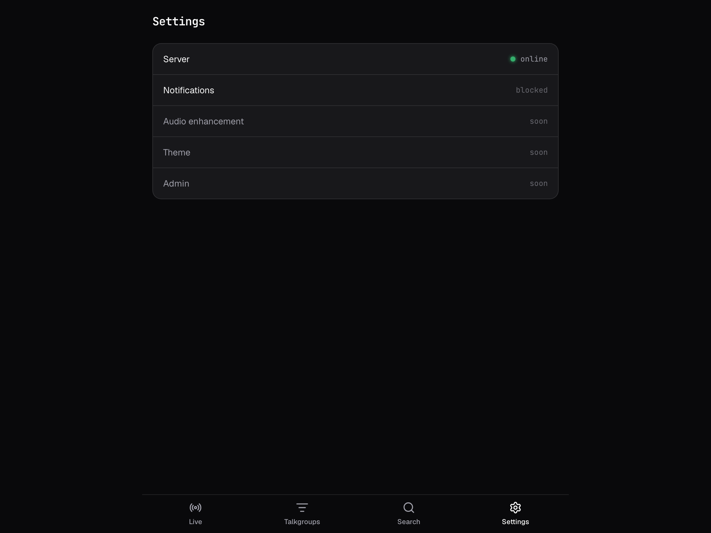

# Using Radio-Scout

This is the listener's guide — what the app does and how to get it to do what you want. If you
are the one *running* the instance, see [operating.md](operating.md) and
[deploy.md](deploy.md).

You need no account and no password. Everything about how you listen — what you selected, what
you muted, what you held — lives in your own browser and never leaves it.

The app has four screens, on the tabs at the bottom: **Live**, **Talkgroups**, **Search**,
**Settings**.

---

## Live


Calls play automatically as they arrive, filtered to the Talkgroups you selected. The card
shows what is playing — Talkgroup, System, tag and group, the waveform with playback position,
frequency, TGID, unit ID and time — with an LED in the Talkgroup's colour.

Top right: **Q** is the listening queue, how many Calls are waiting behind this one, and a dot
showing whether the live feed is connected. Underneath the card is **RECENT**, the handful that
just played, so you can catch what you missed.

### The controls

| Control | What it does |
| --- | --- |
| **LIVE FEED** | The master switch. See below — it is not the same as Pause. |
| **HOLD SYS** | Play only this System until you release it. Your previous selection comes back when you do. |
| **HOLD TG** | The same, narrowed to just this Talkgroup — for following one incident. |
| **SKIP** | Abandon the current Call and jump to the next in the queue. |
| **REPLAY** | Play the current Call again from the start. |
| **PAUSE** / **RESUME** | Stop and restart playback. Calls keep arriving and queueing while paused. |
| **AVOID** | Mute this Talkgroup so it stops interrupting. |
| **30 / 60 / 120 MIN** | Avoid this Talkgroup, then bring it back automatically after that long. |

### Turning the feed off, versus pausing it

**Pause** stops the sound. Everything else carries on: Calls keep arriving, the queue keeps
filling, and when you resume you are behind by however long you paused.

**LIVE FEED off** stops everything. The Call playing stops, the queue empties, and the
connection to the server closes — so an off feed costs no data and no battery, which matters on
a phone. The header reads **FEED OFF** with an amber dot, so you can always tell "I switched
this off" from **NO LINK**, which means the server went away.

Two things follow from it being a real off:

- **Turning it back on starts from now.** The traffic you missed is not replayed — that silence
  was the point. Whatever is happening when you switch back on is what you hear, and the archive
  under **Search** still has the rest.
- **If you have notifications turned on, they start arriving.** Radio-Scout does not notify you
  about Calls while your feed is open, because you are already hearing them. With the feed off
  you are not, so your phone takes over — which makes the toggle the way to put Radio-Scout in
  your pocket without missing the Talkgroups you care about.

Your choice is remembered per **Profile** (the `?id=` in the URL), so reloading the page does
not blast you with audio you switched off. Anyone who never touches the toggle gets the feed
live and playing, as before.

**Hold and Avoid are opposites, and both are temporary.** Hold means "only this"; Avoid means
"anything but this". A timed Avoid is the one to reach for when a Talkgroup is having a busy
half hour but you do not want to forget you silenced it — which is exactly how a permanent mute
turns into missing something a week later.

---

## Talkgroups


What you hear. Everything the instance has ever received a Call for appears here, because
Systems and Talkgroups are created automatically the first time they are heard — nobody has to
configure a list up front.

Three ways to pick, and they compose:

- **Groups** — cross-system categories like Fire, Law, EMS. Tap one to switch every Talkgroup
  in it on or off at once. The counter (`2/2`) shows how many of its Talkgroups are currently on.
- **Tags** — the single service label each Talkgroup carries, like *Fire Dispatch* or
  *Law Talk*. Same bulk behaviour.
- **Individually** — the checkboxes at the bottom, grouped by System, with each Talkgroup's TGID
  on the right. The filter box matches on name, tag or TGID.

**ALL ON** / **ALL OFF** at the bottom, and a per-System **ALL OFF**, are the fastest way to
start from nothing and add just what you want.

Your selection is saved in this browser and survives a reload. It is also what push
notifications use, so turning a Talkgroup off here stops notifying you about it too.

### Two independent setups in one browser

Add `?id=` and a name to the URL:

```
http://<host>:3000/?id=truck
http://<host>:3000/?id=desk
```

Each name is a separate **Profile** with its own selection, avoids and holds — nothing is
shared between them. Bookmark each one, or install them as two home-screen apps. With no `?id=`
you get the default Profile.

---

## Search


The Archive: every Call the instance still holds, however you selected the live feed. Filter by
time range, System, Talkgroup, Group and Tag, and sort newest or oldest first. *Archive spans*
tells you how far back the instance's history actually goes, which is decided by its retention
policy.

Each result plays in place, or downloads with the arrow. **PLAYBACK MODE**, top right, switches
from the live feed to playing the search results in sequence — for working through an incident
after the fact rather than waiting on what arrives next. Live feed and playback mode are
mutually exclusive: you are in one or the other.

---

## On your phone

This is the part rdio-scanner does badly, and the reason a lot of this project exists.

### Install it

**iOS/iPadOS (Safari):** Share → **Add to Home Screen**. It must be Safari; other iOS browsers
cannot install a web app.

**Android (Chrome):** an install prompt appears, or menu → **Install app**.

Installing gives you a real app icon, no browser chrome, and — on iOS — the only reliable way
to get background audio. The app shell also works offline: it opens and shows the interface
without a connection. Audio itself needs the server, since Calls are not cached.

### Background audio and the lock screen

Play a Call, lock the phone, and audio keeps going. The lock screen and Control Centre get
working transport controls — play/pause and next — with the Talkgroup shown as the track. It
works because audio is served as real URLs to a real `<audio>` element driven by the Media
Session API, which is the arrangement iOS honours; rdio-scanner's WebAudio approach is
suspended by iOS the moment you put the phone away.

If audio stops when you lock the phone, the usual cause is that you are running from the
browser rather than the installed app.

### Notifications

**Settings → Notifications** turns on Web Push. You get notified about Calls on the Talkgroups
you selected — but **only when you are not already listening**, since a device with the live
feed open already has the Call.

Notifications are deliberately bounded: at most one per Talkgroup per device per window (five
minutes by default), and each carries a count of the Calls it stands for. A system that goes
busy can't turn into two hundred buzzes, and nothing is silently thrown away to achieve that —
the count tells you what happened while you were away.

Turning it off unsubscribes this device. Each browser and each Profile subscribes separately.

---

## Settings



Currently: whether the server is reachable, and the notifications switch.

**Audio enhancement**, **Theme** and **Admin** are listed but not built yet — they read "soon"
because that is honest. Enhancement *works*, but it is configured on the server rather than per
listener; see [operating.md](operating.md#audio-enhancement).

Almost nothing else is a per-listener setting by design: what the instance does is the
operator's TOML file, not a preference panel.

---

## Troubleshooting

**"unreachable" on the Settings screen, or the Live dot is not green.** The server is down or
you have no route to it. The app shell still loads from cache when installed, which is why you
can see this message at all.

**Nothing plays, but Calls are arriving.** Check the Talkgroups screen — a Talkgroup that is
switched off, or Avoided, is silently skipped. `ALL ON` is the quick test.

**Audio stops when the phone locks (iOS).** Use the installed app, not Safari with a tab open.

**The queue keeps growing.** More is arriving than plays in real time. Narrow the selection, or
use SKIP — the queue is a backlog of things you have not heard, not a buffer that drains on its
own.

**A Talkgroup went quiet and you don't know why.** You probably Avoided it. Avoids without a
timer stay until you clear them.
